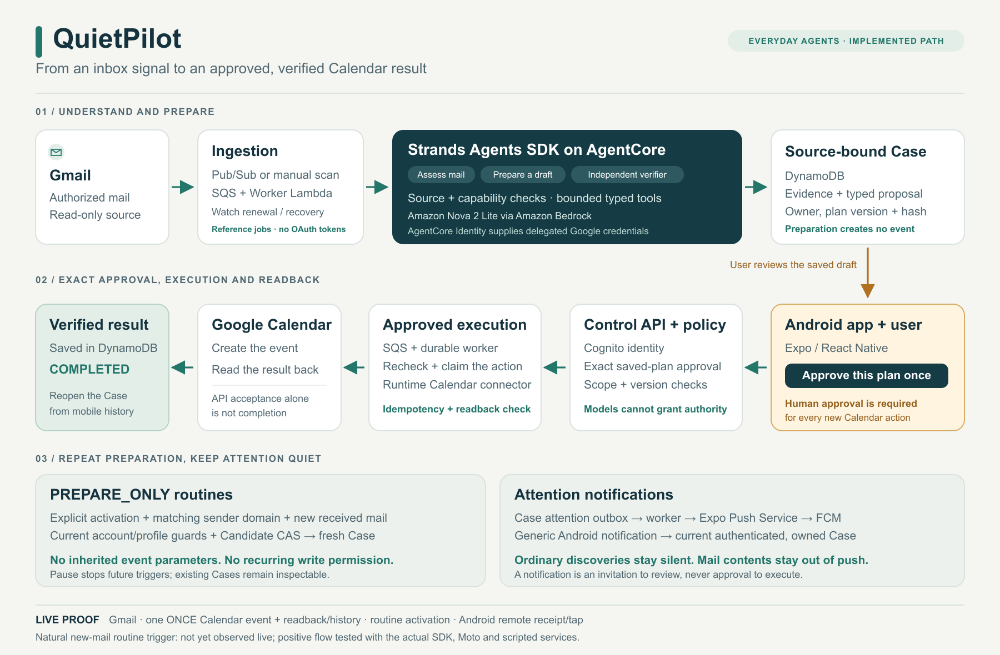

# QuietPilot

[Public source](https://github.com/kcyoow/quietpilot-agents-for-humans) · [Download Android APK](https://github.com/kcyoow/quietpilot-agents-for-humans/releases/download/v0.1.0-hackathon/quietpilot-preview.apk) · [Release notes](https://github.com/kcyoow/quietpilot-agents-for-humans/releases/tag/v0.1.0-hackathon)

Further fresh-account Calendar and remote-push checks were intentionally skipped for this release at the participant's direction; they remain unverified. The completed fresh-account Gmail checks and earlier original-account Calendar/push evidence remain valid. Google testing-user allowlisting still needs to be arranged with the participant; private contact details are not published.

An everyday mail agent that prepares useful next steps, asks before changing your calendar, and verifies the result.

QuietPilot finds useful work in authorized Gmail sources and puts the source, plan, decision and outcome into one **Case**. For a Calendar action, you review the exact event and approve it once. The backend creates it and reads it back from Google before showing completion. A verified Case can also suggest a **PREPARE_ONLY** routine for new matching mail; each future Calendar action still needs its own approval. Generic attention notifications bring you back when a decision is needed.

The working Android path uses **Strands Agents SDK**, **Amazon Bedrock AgentCore**, **Amazon Nova 2 Lite**, Cognito and an AWS control API/worker. It has completed real Gmail ingestion, one approved Calendar creation/readback and native history reopening.

[Judge testing instructions](docs/submission/judge-testing.md) · [Architecture](docs/submission/architecture.md) · [English submission draft](devpost-submission.md) · [Runtime evidence](docs/runtime-verification.md)

**The standalone Android preview is built and has passed fresh-account checks.** Version 0.1.0 targets ARM64 Android API 24+ and includes JavaScript; its fresh-emulator checks ran without Metro. Fresh sign-up/sign-in, Gmail consent/return and session persistence after a same-signer replacement were verified. The public source and APK release links are listed above; Devpost submission and video publication are separate. Google OAuth is in testing mode with two allowlisted users; judges must arrange access before connecting Google. See the [judge guide](docs/submission/judge-testing.md) for the APK checksum, access gate and remaining checks.



## Implementation and verification

Snapshot: **2026-09-15, standalone English preview and fresh-account checks**. Historical external-action proof and the current in-progress scan are distinguished below.

- The latest original-account mail scan completed with **62 messages** on September 15. The UI says “Mail found. Some task suggestions are still incomplete.” Mail collection is complete, while some optional action suggestions remain unprepared. This is not a zero-warning or mailbox-wide accuracy claim; validation guards remain unchanged.
- A mail review completed as `NO_ACTION` and remained available in history.
- One earlier mail-derived private Calendar event was approved with `ONCE`, created, read back by the server, displayed as `COMPLETED`, and reopened from native history. It had no invitees or reminders.
- A real `devpost.com` `DEADLINE` routine was proposed as `PREPARE_ONLY`, explicitly activated by the user, and remained `ACTIVE` after native/server-list refresh. The authenticated Pub/Sub entry and both enabled maintenance schedules are confirmed in CloudFormation configuration. A new real-mail routine trigger remains unobserved; every resulting Calendar operation still needs separate exact approval.
- A generic notification passed through the actual server → Expo → FCM → Android path. Tapping it from HOME opened the exact owned LIVE Case. Notification OFF persisted on server refresh; re-registration ON and state after device resume were verified. A new English remote notification on the original connected device opened the owned Case and displayed its date/time question; that QA Case was then `STOPPED`. These checks added no Calendar approval or write.
- Runtime 89/`DEFAULT` 89 is `READY`, and the Worker deployment reached `UPDATE_COMPLETE`. The standalone APK is non-debuggable and uses a dedicated signer. A fresh account saw none of the original account's work; Gmail consent/return, session/connection retention after replacement and persisted notification ON were verified. Further Calendar and remote-push checks on this account were intentionally skipped and remain unverified.
- The latest full checks passed **1,919 Python tests in 41.77 seconds and 577 mobile tests in 41 suites in 5.19 seconds**. The earlier SDK alignment passed Expo Doctor 21/21. SDK/Moto integration separately covers new-mail routine preparation, approval waiting and duplicate suppression.

A routine triggered by newly received matching real mail, complete optional-action preparation, mailbox-wide recommendation accuracy, physical-device QA, SmartThings and SMS integration remain outside the completed evidence. This verification added no new external Calendar event.

## Run locally

Use Node.js **22.13 or later in the 22.x line**, npm, Python **3.12** and uv. Android development also needs Java **17**, the Android SDK and a device or emulator. On macOS, the helper below selects the installed Java 17, Android SDK and Homebrew Node 22 paths; it does not install them.

```sh
source scripts/project-env.sh
npm ci
uv sync --all-packages --frozen
```

Configure the three public mobile deployment values in `apps/mobile/.env.local` as described in the [runtime verification guide](docs/runtime-verification.md#configure-the-mobile-client). A running LIVE app needs the configured backend and a real Cognito account; there is no prefilled test login.

A fresh Android clone must also supply the ignored `apps/mobile/google-services.json` from the intended Firebase Android app, matching the configured Android package and Firebase/EAS project. Do not commit service-account private keys or push tokens.

For an Android development build:

```sh
source scripts/project-env.sh
npm run android -w mobile
```

For an already installed development client:

```sh
source scripts/project-env.sh
EXPO_NO_TELEMETRY=1 npm run start -w mobile -- --dev-client --localhost --port 8081 --android
```

`npm run web -w mobile` starts the browser frontend. The native Android flow is the verified consumer for Google OAuth and Calendar completion; a working web preview is separate evidence.

The workspace defaults to **LIVE**. Development builds also provide explicit **SCENARIO** fixtures for UI states and errors. Select the LIVE/server option on the developer scenario screen (`/prototype-scenarios`) to leave a saved scenario. Scenario Cases and actions do not prove external integrations; authentication still uses Cognito.

## Local validation

```sh
source scripts/project-env.sh
npm run mobile:verify
npm test
```

`mobile:verify` checks mobile formatting, lint, types, Jest tests and Expo Doctor. `npm test` checks the workspace/contracts, Python tests, infrastructure types/tests and mobile tests. `test:python` includes the existing ephemeral Moto dependencies; the latest full Python run passed 1,919 tests. Local tests do not replace live verification.

See [runtime setup, verification steps and known limits](docs/runtime-verification.md) for the existing AWS/Google prerequisites and the distinction between a local test, a deployed runtime and a verified external action. Deployment and model calls require an authorized target and spend scope; the current live evidence came from an already authorized development deployment.

Product scope, PRD, technical specification and the original build checklist remain under [docs/hackathon-build](docs/hackathon-build/). They describe the intended product; the runtime guide records the dated verification boundary.

## License

A root [MIT license](LICENSE) is included for publication review. The original Expo mobile starter [license notice](apps/mobile/LICENSE) is preserved. Space Mono retains its original metadata and [SIL Open Font License 1.1 notice](apps/mobile/assets/fonts/LICENSE-SpaceMono.txt). Publication will use a new repository with fresh, reviewed source history; the existing private repository stays private.
